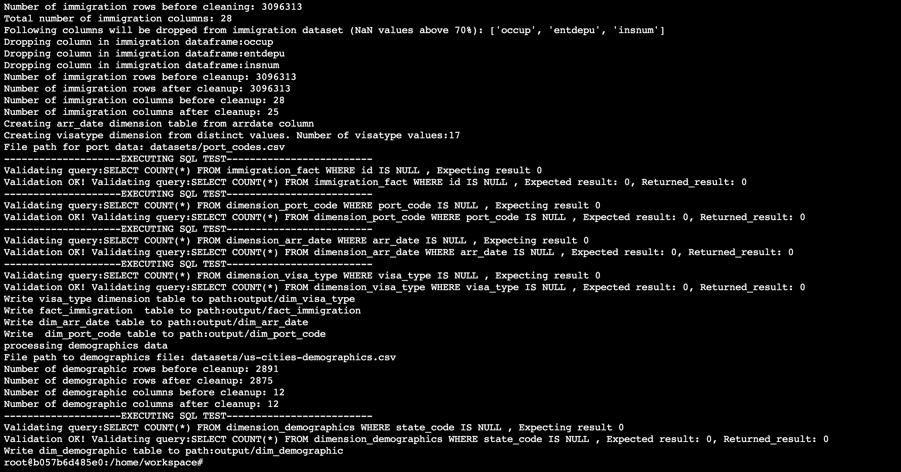

# Capstone Project data engineering

# Analyze I94 Immigration Data and the U.S. City Demographic Data

### Data Engineering Capstone Project

#### Project Summary

In this project we we analyze the immigration dataset I94 Immigration Data and the U.S. City Demographic Data. Based on
these data we could try to discover correlations between immigration and total population in certain states. Additionaly
it would be possible to discover how much the immigration influences the foreign born statistic or do certain states
with higher foreign born values attract more immigration.

The project follows the follow steps:

* Step 1: Scope the Project and Gather Data
* Step 2: Explore and Assess the Data
* Step 3: Define the Data Model
* Step 4: Run ETL to Model the Data
* Step 5: Complete Project Write Up

### Step 1: Scope the Project and Gather Data

#### Scope

For this project Apache Spark will be used for analyzing the datasets and preparing the data. Following datasets will be
used: I94 Immigration Data and the U.S. City Demographic Data As the immigration dataset is very large we will use the
data for APRIL 2016, this dataset allows contains over 3 million rows so this should be enough for fulfilling the
project scope regrading the number of records. To additional enrich the data the demographic data is loaded to be able
to analyze correlations bettwen these datasets.

The data is load into datasets and cleaned of NaN values or empty rows. Additional dimension tables are generated out of
the immigration data and demographic data. In the jupyter notebook we will first analyze the data and try discover best
ways how to clean the data and how to setup the datamodel. The focus will be on local execution, but the path variables
in the configuration capstone file `capstone.cfd` is also prepared that we could execute the pipeline in the cloud with
EMR. The ETL pipeline file is `etl.py `

##### I94 Immigration Data Description

This data comes from the US National Tourism and Trade Office. A data dictionary is included in the workspace. Data is
locally stored in the workspace. This dataset is stored separately per month in the SAS format. We will use as test only
the first data file for the APRIL `i94_apr16_sub.sas7bdat`. The path to the dataset is stored in the configuration
file `capstone.cfg` under the keys `['DATASETS']['IMMIGRATION_DATA_PATH_LOCAL']`. To be a valid dataset for the capstone
project it needs to contain at least 1 million rows.


##### U.S. City Demographic Data

This dataset contains information about the demographics of all US cities and census-designated places with a population
greater or equal to 65,000. This data comes from the US Census Bureau's 2015 American Community Survey. The data ist
local save in the dataset folder and available as csv file. The path to the dataset is stored in the configuration
file `capstone.cfg` under the keys `['DATASETS']['DEMOGRAPHIC_DATA_PATH_LOCAL']`. The filename is stored in
configuration item `['DATASETS']['DEMOGRAPHIC_DATA_FILE']`


### Step 2: Explore and Assess the Data

#### Explore of I94 Immigration Data

We will first try to find the columns containing most of the missing values. As a threshold we will define if a column
has more the 70% missing values it will be removed from the dataset. Folloing columns have more then 70% missing values:


###### Cleaunup of I94 Immigration Data

For the immigration data we will remove every column that has more the 70% missing values. Also, we will remove any
duplicates from the primary keys and drop all rows containing NaN values as primary key.

```
Number of rows before cleanup: 3096313
Number of rows after cleanup: 3096313
Number of columns before cleanup: 28
Number of columns after cleanup: 25
```

#### Explore of U.S. City Demographic Data

We will frist try to find the columns containing most of the missing values. As a threshold we will define if a column
has more the 70% missing values it will be removed from the dataset.


As we don't have a significant NaN values in certain columns we will continue with searching other data inconsistency. We
will continue to do check if there are duplicate values or Nan values. As primary key multiple columns must be
used: `'City','Race','State Code'`

```
Number of rows before cleanup: 2891
Number of rows after cleanup: 2875
```

### Step 3: Define the Data Model

#### 3.1 Conceptual Data Model


The fact table comes from the immigration dataset. This dataset in his raw setup contains 28 columns. With additional
cleanup of columns which has NaN values the fact datamodel is reduced to 25 columns. The primary key is the cicid column
which we rename to *id*.

The dimensions tables are generated from the immigration dataset values and additional from the demographics' dataset.
The *dim_port_code* dimension tables is generated from the description of the immigration dataset. The port codes are
saved in a separated csv files under [port_codes](datasets/port_codes.csv).

The *dim_arr_date* table is created from the arrival date of the immigration dataset. Additional the data is enriched
with month, weekday, day, hour, year data from the arrival date. The *dim_visa_type* table contains visa_types from the
immigration datasets. The *dim_gemographics* table contains data from the demographics datasets about based on the US
state level. The link to the immigration dataset is the arrival state in the immigration fact table.

Based on the correlations between the fact and demographics dimension we could try to discover possible relations
betwwen states with high population and immigration arrival. Additional relations between foreign born values in certain
stats or household sizes could be discovered and immigration arrivals in certain states.

#### 3.2 Mapping Out Data Pipelines

List the steps necessary to pipeline the data into the chosen data model

### Step 4: Run Pipelines to Model the Data

#### 4.1 Create the data model

Let's first create the dimension tables out of the cleaned datasets.


##### 4.1.2 Analyze port dimension table


##### 4.1.3 Analyze arrival date table

```
def create_arr_date_table(df):
    # SAS date value is a value that represents the number of days between January 1, 1960, and a specified
    # This UDF converts SAS data value to standard datetime format
    @udf(StringType())
    def convert_sas_to_datetime(x):
        if x:
            return datetime(1960, 1, 1).date() + dt.timedelta(x).isoformat()
        return None

    arr_date_table = df.select(['arrdate']).withColumn("arr_date", convert_sas_to_datetime(df.arrdate)).distinct()
    arr_date_table = arr_date_table.withColumn('arrival_day', dayofmonth('arr_date'))
    arr_date_table = arr_date_table.withColumn('arrival_week', weekofyear('arr_date'))
    arr_date_table = arr_date_table.withColumn('arrival_month', month('arr_date'))
    arr_date_table = arr_date_table.withColumn('arrival_year', year('arr_date'))
    arr_date_table = arr_date_table.withColumn('arrival_weekday', dayofweek('arr_date'))
    arr_date_table = arr_date_table.withColumn('id', monotonically_increasing_id())
    return arr_date_table
```

#### 4.2 Data Quality Checks

The immigration datasets and dimension datasets are validated if the contain any empty ids. Additional the generated
dimension tables visa_type and arr_date are validate if they the same number of distinct records like the fact tables.

Example quality checks of immigration dataset:

```
def data_quality_check_immigration(spark, immigration_fact, dimension_port_code, dimension_arr_date,
                                   dimension_visa_type):
    """
    Method checks if all tables dont contain null values in primary key. Also dimension table check are executed
    :param spark: spark session context
    :param immigration_fact: immigration dataframe
    :param dimension_port_code:  port_code dataframe
    :param dimension_arr_date:  arr_date dimension dataframe
    :param dimension_visa_type: visa_type dimension
    :return:
    """
    sql_check = [
        ('SELECT COUNT(*) FROM immigration_fact WHERE id IS NULL', 0),
        ('SELECT COUNT(*) FROM dimension_port_code WHERE port_code IS NULL', 0),
        ('SELECT COUNT(*) FROM dimension_arr_date WHERE arr_date IS NULL', 0),
        ('SELECT COUNT(*) FROM dimension_visa_type WHERE visa_type IS NULL', 0)
    ]
    for query in sql_check:
        print('--------------------EXECUTING SQL TEST-------------------------')
        sql_query, expected_result = query
        print("Validating query:{} , Expecting result {}".format(sql_query, expected_result))
        result = spark.sql(sql_query)
        new_count = result.collect()[0][0]
        if new_count != expected_result:
            raise ValueError("ERROR Validating query:{} , Expected result: {}, Returned_result: {}".format(sql_query,
                                                                                                           expected_result,
                                                                                                           new_count))
        else:
            print("Validation OK! Validating query:{} , Expected result: {}, Returned_result: {}".format(sql_query,
                                                                                                         expected_result,
                                                                                                         new_count))

    distinct_arr_date_fact = immigration_fact.select("arr_date").distinct().count()
    distinct_arr_date_dimension = dimension_port_code.distinct().count()
    if distinct_arr_date_fact != distinct_arr_date_dimension:
        ValueError(
            "arr_date in fact table {} are not equal arr_date in dimension table {}".format(distinct_arr_date_fact,
                                                                                            distinct_arr_date_dimension))

    distinct_visa_type_fact = immigration_fact.select("visa_type_id").distinct().count()
    distinct_visa_type_dimension = dimension_visa_type.distinct().count()
    if distinct_visa_type_fact != distinct_visa_type_dimension:
        ValueError(
            "visa_type in fact table {} are not equal visa_type in dimension table {}".format(distinct_visa_type_fact,
                                                                                              distinct_visa_type_dimension))

```

#### 4.3 Data dictionary

**fact_imigration**
<br/>

| Column        | Description   |
| :------------- |:--------------|
| id            | created from cicid used from as primary key |
| arr_date      | arrivale date in the USA.      |
| arr_mode      | arrival mode origin field is i94mode      |
| dep_date      | departure date       |
| age      | age at arrivale from I94BIR column     |
| visa_code      | I94VISA - Visa codes collapsed into three categories:1 = Business, 2 = Pleasure, 3 = Student |
| port_code      | port code from i94port      |  
| visa_post      | Department of State where where Visa was issued     |    
| gender         | Gender    |      
| airline        | Airline used to arrive in U.S.     |    
| visa_post      | Department of State where where Visa was issued     |    
| flight_num     | Flight number    |  
| visa_type_id   | Foreign key of visa type dimension table    |  
| birth_country_code   | code of birth country   |  
| residence_code   | residence code from I94RES    |  
| match_fag   | Match of arrival and departure records    |  
| birth_year   | birth year   | 
| stay_until   | Date to which admitted to U.S. (allowed to stay until)   | 
| adm_num   | Admission Number   | 
| arr_flag   | Arrival Flag - admitted or paroled into the U.S | 
| dep_flag   | Departure Flag - Departed, lost I-94 or is deceased   | 
|dtadfile|Character Date Field - Date added to I-94 Files|
|year |4 digit year |
|month|Numeric month |
|state|Address state|

<br/><br/>

**dim_port_code**

| Column        | Description   |
| :------------- |:-------------|
| port_code            | airport code |
| city      | airport city      |
| state      | airport state|

<br/><br/>
**dim_demographics**

| Column        | Description   |
| :-------------- |:-------------|
| median_age            | city median age |
| male_population      | male population of the city |
| number_of_veterans      | number of veterane|
| female_population            | female population |
| total_population      | total population in city   |
| state_code      | city state code|   
| average_household_size      | average household size|   
| foreign_born      | foreign born in city|   
| city| city name | 
| state_name| state name | 
| state_code| state code| 
| race|  race name | 
| count| population number in certain race | 

<br/><br/>
**dim_visa_type**

| Column        | Description   |
| :------------- |:-------------|
| visa_type_id            | unique id of visa type|
| visa_type      | Class of admission legally admitting the non-immigrant to temporarily stay    |

<br/><br/>
**dim_arr_date**

| Column        | Description   |
| :------------- |:-------------|
| arrdate            | arrival date |
| arr_day      | arrival day      |
| arr_week      | arrival week|
| arr_month      | arrival month|    
| arr_year      | arrival year|
| arr_weekday      | arrival weekday|    
| id      | unique key|  

#### Step 5: Complete Project Write Up

<div style="text-align: left;"> 

Following tehnologies has been used for the project:

- Python - Python is easy to learn as well because of its simple syntax. This simple, readable syntax helps Big Data
  pros to focus on insights managing Big data, rather than wasting time in understanding technical nuances of the
  language. This one is one of the primary reasons to choose Python for Big Data.

- Apache Pysport - Provides several advantages over MapReduce: it is faster, easier to use, offers simplicity, and runs
  virtually everywhere. It has built-in tools for SQL, Machine Learning, and streaming which make it a very popular and
  one of the most asked tools in the IT industry.

- Pandas - is mainly used for data analysis and for analyzing the immigration and demographic datasets. Pandas allows
  importing data from various file formats such as comma-separated values, JSON, SQL, Microsoft Excel. Pandas allows
  various data manipulation operations such as merging, reshaping, selecting, as well as data cleaning, and data
  wrangling features.

Data can be update on monthly bases as new datasets come out trends can be analyzed on month based especially for the
immigration fact table which is partitioned by month.

##### Questions:

*The data was increased by 100x.*

- Data can be partitioned by lower granularity probably by weekly or daily basis depending on the growth of the data.
  Additional EMR can be used for such cases adding worker not with more compute power and memory.

*If the pipelines were run on a daily basis by 7am*

- Apache Airflow can be used for scheduling workflows

*If the database needed to be accessed by 100+ people*

- Amazon Redshfit can be used if the data needs cerain access priviliges. Additionaly adding more nodes to Redshift or
  bigger cluster will help us to deal with the necessary write scaling

</div>

#### Step 6: Execution and file description

> The projects consist of following directories

    ├── datasets            [contains all imputdatasets]     
         ├── 18-83510-I94-Data-2016 [immigration data folder 2016 used for pandas]
         ├── sas_data       [parquet files of immigration dataset for april 2016]
    ├── img                 [image files used in readme]
    ├── output              [in this directoy the parquet fiels are saved]
    ├── Capstone Project Template.ipynb      [jupyter working notebook for analysis]
    ├── capstone.cfg        [configuration file for dataset paths] 
    ├── etl.py              [Python ETL script used for data load transformations]

Explanation of single files and operators:

[` workspace files`] :

- `Capstone Project Template.ipynb`- Jupyter notebook used for analysis of dataset.
- `capstone.cfg `: Configuration file contains all paths to dataset files and flag or local or remote execution
- `etl.py `:  Ptyhon ETL file for processing the datasets and performing all operations

To start ETL pipeline just:

```
python3 etl.py
```

Execution example:



