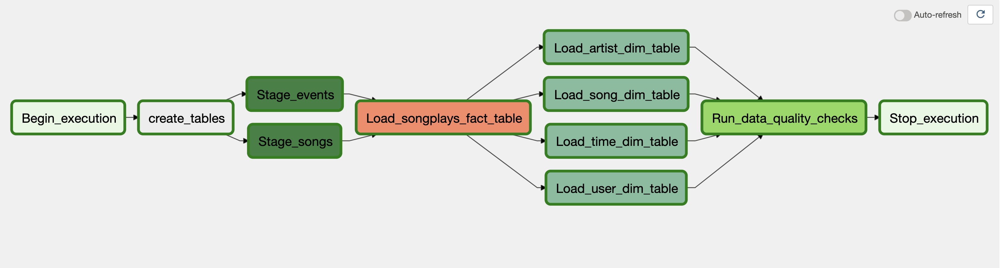

# Data Pipeline with Airflow

## Overview

A music streaming company, Sparkify, has decided that it is time to introduce more automation and monitoring to their
data warehouse ETL pipelines and come to the conclusion that the best tool to achieve this is Apache Airflow.

They have decided to bring you into the project and expect you to create high grade data pipelines that are dynamic and
built from reusable tasks, can be monitored, and allow easy backfills. They have also noted that the data quality plays
a big part when analyses are executed on top the data warehouse and want to run tests against their datasets after the
ETL steps have been executed to catch any discrepancies in the datasets.

The source data resides in S3 and needs to be processed in Sparkify's data warehouse in Amazon Redshift. The source
datasets consist of JSON logs that tell about user activity in the application and JSON metadata about the songs the
users listen to.

## Project Overview

This project uses Apache Airflow to create a pipeline to extract and transform data from S3 into Amazon Redshift.
The project is optimized for the Apache Airflow version **2.x** and contains the latest Apache Airflow definition of the
operators. For quick start the provided docker compose files can be used. The Airflow DAG contains following tasks



## Datasets

For this project, you'll be working with two datasets. Here are the s3 links for each:
```
Log data: s3://udacity-dend/log_data
Song data: s3://udacity-dend/song_data
```
## Structure

> The projects consist of following directories

    ├── dags        [contains the airflow dags]                     
    ├── img         [image files used in readme]
    ├── log         [log directoy for airflow logs]
    ├── plugins     [aifrlow plugins directory]
    │     ├── udacity_plugin  [udacity custom plugin folder] 
    │           ├── helpers   [contains the SQL queries used in the DAG]
    │           ├── operators [contains all custom operators]


Explanation of single files and operators:

[`dags`] : 
  - `dags/udac_example_dag.py`: Dag file contains task order and definition.

[` plugins/udacity_plugin/operators`] :
- `stage_redshift.py`- The stage operator is expected to be able to load any JSON formatted files from S3 to Amazon Redshift. The operator creates and runs a SQL COPY statement based on the parameters provided.
- `load_dimension.py`: Loads dimension table from staging table.  Can be parametrized to truncate before insert.
- `load_fact.py`:  Loads fact table from staging table. Can be parametrized to truncate before insert.
- `data_quality.py`: Data quality operator, which is used to run checks on the data itself.

[` plugins/udacity_plugin/helpers`] :
- `sql_queries.py`: Contains SQL queries for the ETL pipeline and also the create table queries for redshift

[`root`] :
- `docker-compose.yaml`: Docker compose file can be used for locally starting airflow with all dependencies 

## Requirements 

Before executing the the udacity_example_dag add following connections to Airflow:

- AWS credentials with connection_id : **_aws_credentials_**
- Postgres connection with connection_id : **_redshift_**

| WARNING: YOU AWS_KEY and SECRET_KEY will be locally stored in the log files in the logs directory. Make sure that you never push these logs to GIT or generally publish them to the internet! |
| --- |